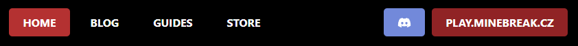

# MINEBREAK REACT WEBSITE

## SCRIPTS

### `npm start`

Runs the app in the development mode.

### `npm test`

Launches the test runner in the interactive watch mode.\
See the section about [running tests](https://facebook.github.io/create-react-app/docs/running-tests) for more information.

### `npm run build`

Builds the app for production to the `build` folder.\
See the section about [deployment](https://facebook.github.io/create-react-app/docs/deployment) for more information.

## COMPONENTS

#### MENU:

#### SNACKBAR:

